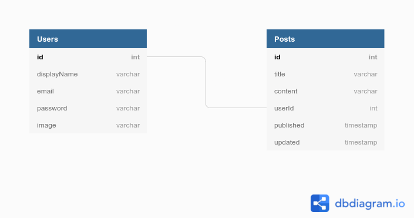
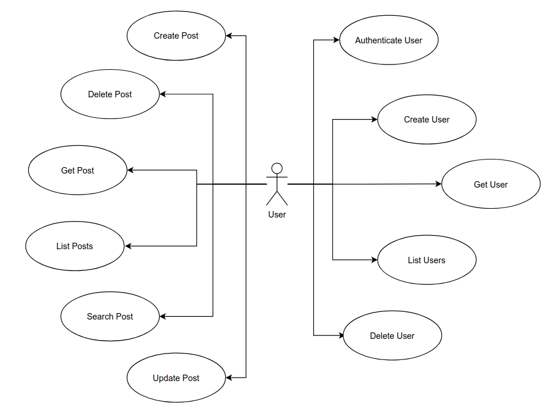

# BlogAPI

> Gerencie posts para seu blog

# :pushpin: Conteúdo
  - [:notebook_with_decorative_cover: Descrição](#notebook_with_decorative_cover-descrição)
  - [:construction_worker: Instalação](#construction_worker-instalação)
  - [:wrench: Iniciando aplicação](#wrench-iniciando-aplicação)
    - [Executando com Docker](#executando-com-docker)
  - [:rocket: Tecnologias utilizadas](#rocket-tecnologias-utilizadas)
  - [:ballot_box_with_check: Checklist de funcionalidades](#ballot_box_with_check-checklist-de-funcionalidades)
  - [:file_folder: Estrutura de Pastas](#file_folder-estrutura-de-pastas)

## :notebook_with_decorative_cover: Descrição

Esta API permite realizar cadastro de usuários e também o gerenciamento de posts para blogs (criar, editar, buscar e excluir).

**Diagrama do Banco de Dados**



**Diagrama de Caso de Uso**



## :construction_worker: Instalação
Primeiramente você precisa instalar os seguintes programas para poder utilizar a aplicação:
- [Node.js](https://nodejs.org/en/download)
- [Yarn](https://yarnpkg.com)
- [Docker](https://www.docker.com/get-started)
- [Docker Compose](https://docs.docker.com/compose/install/)

Após isso você pode clonar o repositório via HTTP com o comando:
```
git clone https://github.com/llucasreis/blog-api.git
```

## :wrench: Iniciando aplicação

Esta aplicação trabalha com diferentes variáveis de ambiente, na raiz do projeto temos o arquivo
`.env.example` com configurações básicas, assim incialmente precisa-se executar os comandos:

```
# Para executar totalmente local:
cp .env.example .env

# Para executar no ambiente Docker:
cp .env.example .env.dev
```

Para o segundo caso é preciso alterar a variável `DATABASE_HOST` para `database`.

### Executando com Docker
Após preparar a variável de ambiente, pra executar a aplicação e o banco de dados, você precisa executar
o seguinte comando:
```
docker-compose -f docker-compose-dev.yml up --build
```

Este comando irá preparar seu ambiente e aplicação estará ouvindo na porta 3333.

Por fim, é necessário executar as migrações do sistema para ele criar as tabelas no banco de dados,
abra um novo terminal dentro da pasta e digite:
```
yarn typeorm migration:run
```

Se o banco e as variáveis de ambiente estiverem configuradas corretamente, as migrações serão executadas
com sucesso.

## :rocket: Tecnologias utilizadas

- Node.js + Typescript
- Express
- PostgreSQL
- TypeORM
- Celebrate (validação de erros nas requisições)
- Jest
- Eslint + Prettier

## :ballot_box_with_check: Checklist de funcionalidades

- Usuários
  - [x] Autenticar Usuário
  - [x] Criar Usuário
  - [x] Buscar Usuário
  - [x] Listar Usuários
  - [x] Deletar Usuário
- Posts
  - [x] Criar Post
  - [x] Deletar Post
  - [x] Buscar Post
  - [x] Listar Posts
  - [x] Pesquisar Posts
  - [x] Atualizar Post
- [x] Ambiente Docker para desenvolvimento
- [x] Ambiente Docker para produção
- [x] Testes unitários
- [x] Github Action para Integração Contínua
- [x] Deploy automático para o Heroku (com Github Action)

## :file_folder: Estrutura de Pastas

- `@types`
  
Específico para sobrescrever tipagens de bibliotecas de terceiros

- `adapters`
  
Adaptadores de bibliotecas externas. Cada pasta apresenta uma funcionalidades, com `contracts` informando que funções o adaptador possui e as implementações em `implementations` das bibliotecas de fato. Caso for utilizado
outra biblioteca para a mesma funcionalidade, basta apenas implementar e alterar na `factory` correspondente.

- `infra`
  
Implementações relacionadas à infraestrutura da aplicação, atualmente possui apenas as migrações do TypeORM.

- `main`
  
Implementações e configurações gerais da aplicação, na pasta `config` temos as configurações da aplicação,
variáveis de ambiente serão carregadas neste pasta. Em `factories` é gerado instâncias de classes que podem ser utilizadas pelos módulos.

- `modules`
  
Nesta pasta se concentra toda a principal implementação da aplicação dividida em dois módulos: `accounts`
e `posts`, cada um segue uma estrutura interna semelhante.

```
├── entities: Armazena as entidades do módulo
|
├── mappers: modifica a entidade para ser apresentada ao usuário se necessário
|
├── repositories
│   ├── contracts: contratos (interfaces) para abstrair 
|implementações
|   |
│   └── typeorm: implementação de fato dos repositórios do TypeORM
|
├── routes: rotas do módulo (que são chamadas em presentation)
|
└── useCases: implementação dos casos de uso da aplicação, cada um pode possuir os seguintes arquivos
    |
    ├── boundary: "fronteiras" do caso de uso, especificamente quais são os parâmetros de entrada e saída
    |
    ├── controller: o controlador que irá receber a requisição
    |
    ├── useCase: o caso de uso de fato, concentrando as regras de negócio
    |
    ├── validation: validação dos parâmetros passados para a rota
```

- `presentation`
  
Toda implementação que será apresentada para o usuário é chamada nesta pasta, assim temos as `routes`,
 `middlewares` e `errors`.

- `tests`
  
Todos os testes estão centralizados nesta pasta. Os `adapters` e `repositories` estão "mockados" para
os testes unitários, e nas pastas `useCases` temos de fato as implementações dos testes.
